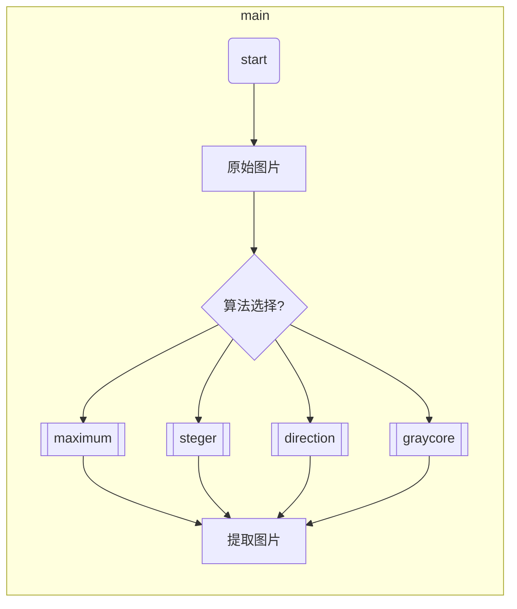

## 程序简介
- 名称：激光中心线提取程序

- 开发环境：
   - 解释器：Python3
   - 其他相关配置见requirements.txt

- 功能简介：用于提取激光中心线的几个算法，包括Steger法，方向模板法，灰度重心法

## 文件结构
- mytest
    - maximum.py 极大值法
    - steger.py：steger法
    - graycore.py：灰度重心法
    - directionmodule.py：方向模板法
    - requestments.txt :需要的库


## 程序说明
##### 流程



### steger.py

- steger

  - ```python
    def __init__(self, img,sigmaX,sigmaY):
    #初始化类,img是灰度图,sigmax和sigmay分别是高斯滤波的参数
    ```

  - ```python
     def computeDerivative(self):#计算偏导数
    ```

  - ```python
    def computeHessian(self,dx, dy, dxx, dyy, dxy):#计算Hessian矩阵
    ```

  - ```python
    def drawimg(self):#画图
    ```

    

### graycore.py

- ```
  graycore
  ```

  - ```python
    def __init__(self,gray_img,sigmax,sigmay):#灰度图，滤波参数Sigmax和Sigmay
    ```

  - ```python
    def graycore(self):#利用极大值法和灰度重心法计算center_line
    ```

  - ```python
    def drawing(self):#画图
    ```

  - ```python
    def proprocessing(self):#Gaussian filter
    ```

    


### directionmodule.py

- ```python
  module
  ```

  - ```python
    def __init__(self,data,threshold,sigmax,sigmay,modulesize):
     #data 为灰度图，threshold为分割阈值，sigmax和sigmay是高斯滤波参数，modulesize是模板大小，根据图片大小确定
    ```

  - ```python
    def createmodule(self):#根据self.modulesize创建四个方向的不同模板
    ```

  - ```python
    def preprocessing(self):#进行高斯滤波和阈值分割，小于指定阈值的像素点置0，提取图像骨架
    ```

  - ```python
    def extraction(self):#进行极值法提取骨架点后再用direction module法确定方向，最后用灰度重心法确定中心线的点 
    ```

    - ```python
      self.point #用于记录中心线的点
      ```

      

  - ```python
    def drawing(self,img):#img是彩色图像，用于draw Img
       #提取结果保存本地
    ```

### maximum_value.py

- ```python
  def maximum()#读取图片并且利用极大值法计算中心线
  ```

  

## 使用说明

使用cv2.imread('your_pic',0)

以灰度图形式读入后，调用响应的函数/类方法即可
